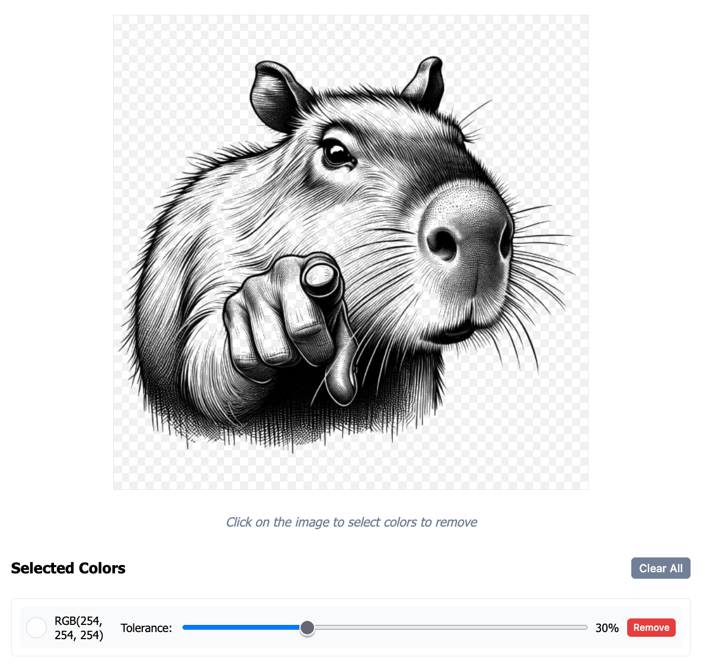

# Tools ⚒️

A collection of small web-based tools and utilities. At least the first iteration of most / all of these is AI generated, usually via Claude Artifacts.

## Available Tools

| Tool | Description | Preview | Link |
|------|-------------|---------|------|
| **Color Background Remover** 🎨 | A simple tool for removing solid color backgrounds from images. Multiple colors can be removed at once. |  | [[🚀 Launch]](https://simson.io/tools/color-bg-remover/) [[`</>` Code]](./color-bg-remover/) |

## License

Unless otherwise specified, all tools are under MIT license.
