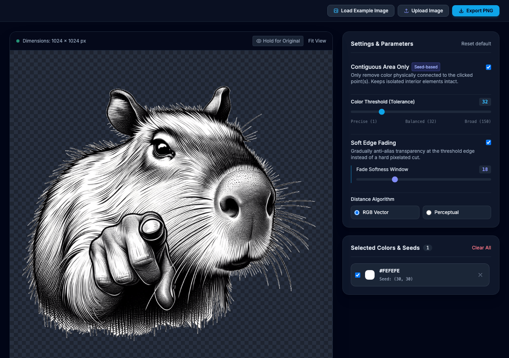
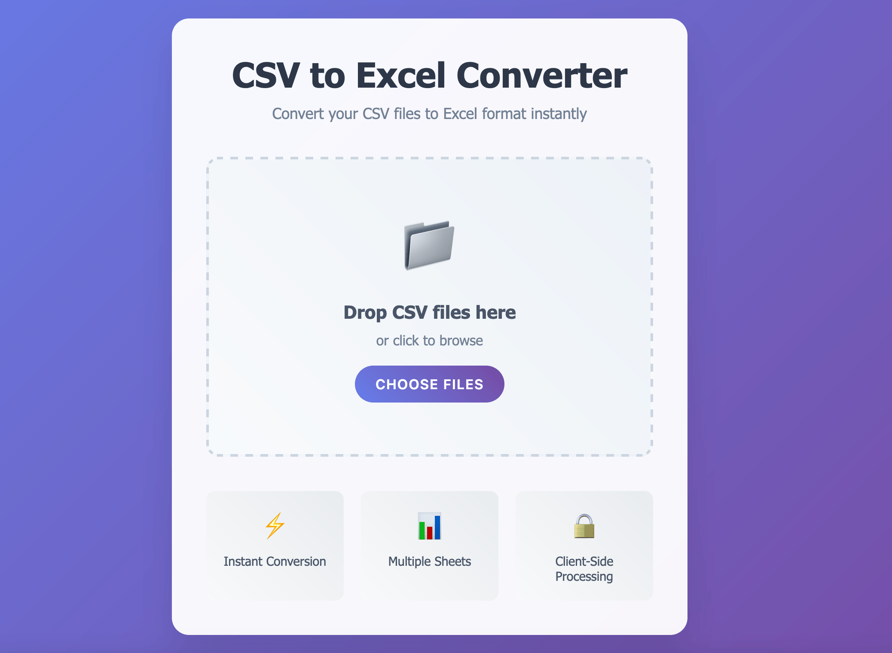
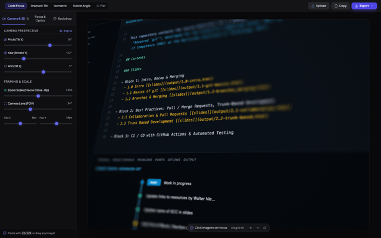

# Tools ⚒️

A collection of small web-based tools and utilities. At least the first iteration of most / all of these is AI generated, usually via Claude Artifacts.

## Available Tools

| Tool | Description | Preview | Link |
|------|-------------|---------|------|
| **Color Background Remover** 🎨 | A simple tool for removing solid color backgrounds from images. Multiple colors can be removed at once. |  | [[🚀 Launch]](https://simson.io/tools/color-bg-remover/) [[`</>` Code]](./color-bg-remover/) |
| **CSV to Excel Converter** 📊 | A simple tool for converting CSV files to Excel format with drag-and-drop functionality. Multiple CSV files can be converted at once into a single Excel file with separate sheets. |  | [[🚀 Launch]](https://simson.io/tools/csv-to-excel/) [[`</>` Code]](./csv-to-excel/) |
| **Perspective & Tilt-Shift Studio** 📸 | A tool for turning plain screenshots into fancy 3D perspective shots with tilt-shift blur, adjustable camera angle/FOV, and high-resolution PNG export. |  | [[🚀 Launch]](https://simson.io/tools/fancy-screenshot/) [[`</>` Code]](./fancy-screenshot/) |

## License

Unless otherwise specified, all tools are under MIT license.
